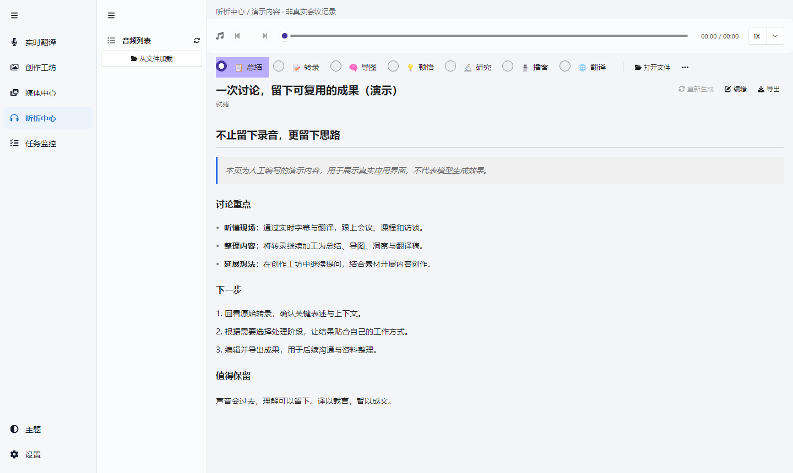
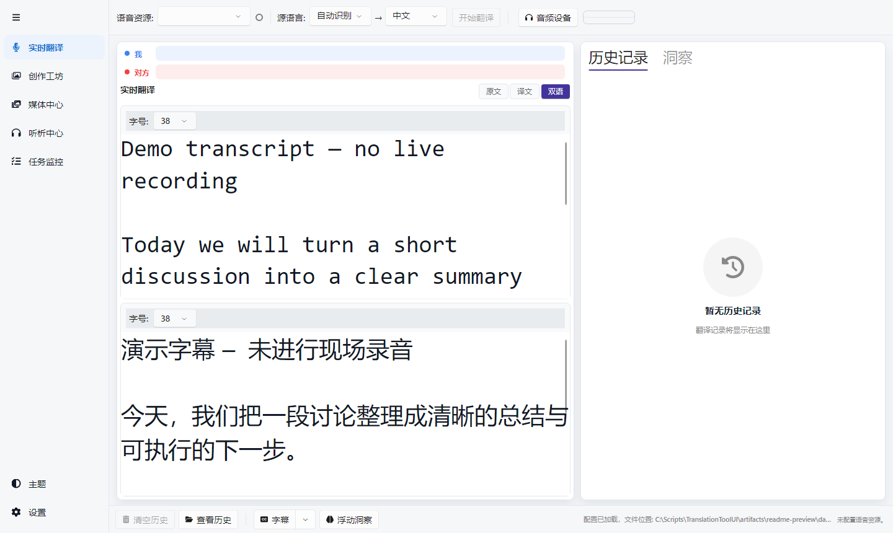
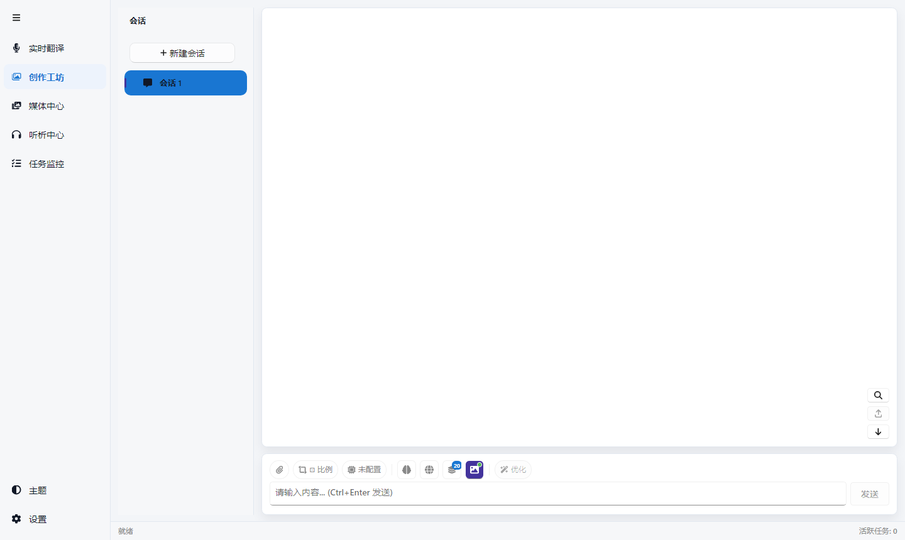
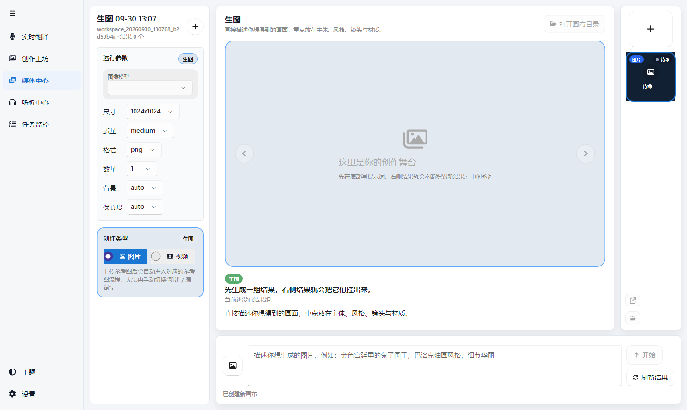

# 译以载言，智以成文。

### 译见 Pro

**让现场的声音可见，让留下的内容可用，让新的想法继续生长。**

面向会议、课程、访谈与内容创作的 Windows AI 工作台。 
从实时字幕与翻译，到音频听析，再到对话、图片与视频创作。

[下载应用](https://github.com/kukisama/TrueFluentPro/releases) · [快速开始](#快速开始) · [功能一览](#功能一览) · [使用须知](#费用与数据你需要知道的事)

> **版本与截图说明**：按当前仓库代码整理，下载版本的具体能力以对应发布说明为准。下方为真实应用界面截图；字幕和总结是人工编写的演示内容，不含真实会议、账号或端点信息，也不代表模型生成效果。

听析中心 · 不止留下录音，更留下思路。

## 每一次交流，都可以继续产生价值

会议结束，不该只留下一个录音文件。看完课程，也不必从头寻找那些值得记住的片段。

译见 Pro 把「听懂、整理、延展」放进同一个桌面工作台：现场用字幕跟上内容，事后把音频整理成结构化成果，再围绕这些内容继续提问与创作。

| 你正在做什么 | 译见可以怎样帮你 |
| --- | --- |
| 参加线上会议、跨语种访谈 | 接收麦克风与电脑播放的声音，查看实时原文、译文或双语字幕 |
| 观看外语课程、视频与直播 | 用置顶字幕浮窗辅助理解，不必一直切回主界面 |
| 整理会议录音、访谈或学习资料 | 在听析中心转录、回听，并进一步生成总结、导图、洞察与翻译稿 |
| 围绕资料继续研究与写作 | 在创作工坊中结合附件提问，按需联网搜索并查看引用来源 |
| 把想法变成视觉素材 | 使用提示词与参考图，开展图片生成、编辑及视频创作 |

## 功能一览

### 01 · 现场听懂：实时字幕与翻译

**把正在发生的交流，变成看得见的内容。**

- **多种音源**：麦克风、系统回环，以及两者混合；识别音源与录制来源可分别选择。
- **多种阅读方式**：原文、译文、双语对照，配合翻译历史回看上下文。
- **字幕浮窗**：置顶显示，可调整字号与透明度；支持全部字幕或按麦克风／系统回环分源显示。
- **边听边整理**：实时页面提供 AI 洞察、预设分析问题与自动洞察，也可使用独立浮动洞察窗口。
- **录音与音频处理**：会话录音留存，支持可配置的 WebRTC 回音消除、降噪与自动增益。
- **多厂商语音资源**：现有连接器涵盖 Microsoft Speech、讯飞、百度与 OpenAI Realtime 路径；语言、翻译链路及认证要求随服务而异。

查看实时翻译界面

*演示配置未连接语音服务；字幕为人工示例。Realtime 需要匹配的服务、模型与协议，并非任意 OpenAI 兼容端点都可用于实时语音。*

### 02 · 听后有所得：听析中心

**同一段音频，不只有逐字稿这一种读法。**

载入音频文件后，可以回听、调速、按转录片段跳转，再根据自己的目标选择后续处理阶段。

| 处理方向 | 用来做什么 |
| --- | --- |
| 转录 | 将声音转成文本，结合片段与时间位置回看 |
| 总结 | 提炼主题、重点与讨论脉络，支持编辑结果 |
| 思维导图 | 以结构化视图梳理内容关系，支持缩放与平移 |
| 顿悟与研究 | 从材料中提炼洞察，进一步组织研究方向与报告 |
| 翻译 | 将转录内容整理成目标语言文本 |
| 播客 | 将内容改写成播客台本，配合已配置的语音合成服务生成音频 |
| 自定义阶段 | 使用自己的提示词套件，让处理结果贴合业务或学习目标 |

阶段预设支持启用、隐藏和批处理参与配置；成果可按当前内容类型导出。转录方式、可用阶段和语音合成能力取决于服务与模型配置。

**处理多份资料时，不必只盯着一个进度条。** 音频任务监控提供阶段状态、并发配置、重试与取消，以及执行历史和 Token 统计，方便了解任务进行到哪一步。

### 03 · 继续追问：创作工坊

**让一次回答，成为下一次思考的起点。**

- **独立会话与模型选择**：组织不同主题的对话，保留历史，也可以从已有消息创建分支。
- **带着材料提问**：支持图片、文本文件附件，以及拖放和粘贴输入。
- **联网搜索与引用**：按需检索网页，查看回复关联的来源；支持 Bing、Google、DuckDuckGo、百度、Bing 新闻及 MCP 搜索配置。
- **从对话走向创作**：结合模型能力进行图片创作与编辑，使用参考素材延展想法。

联网搜索需要网络可达；网页和 AI 回复都应结合来源核实，引用不等于结论必然正确。

### 04 · 把想法做出来：媒体中心

**为图片与视频创作，留出一个专门的工作区。**

- 提示词、参考图与生成参数集中管理，结果在画布中预览。
- 根据模型能力选择图片尺寸、质量、格式，以及视频分辨率与时长等参数。
- 支持参考图编辑与图生视频等创作路径，具体取决于端点和模型。
- 按工作区组织结果与任务历史，生成素材本地归档，可定位到所在文件夹。

查看创作工坊与媒体中心

**创作工坊 · 对话与素材围绕同一主题积累**

**媒体中心 · 提示词、参数与预览集中在一个工作区**

*两张截图展示未配置服务、没有私人历史的初始界面，不包含生成作品。*

### 服务与模型，由你选择

不必为每个功能重复管理一套连接信息。配置中心统一管理语音资源、AI 端点与模型，并按能力分配给不同任务。

- 支持 Azure OpenAI、OpenAI 兼容服务等端点配置，以及适用端点的 Microsoft Entra ID（AAD）认证。
- 通过端点资料包辅助配置，提供模型发现与连接测试入口。
- 为对话、图片、视频、转录和语音合成选择相应模型。
- 支持配置导入导出，以及明亮、深色和跟随系统的主题模式。

**可配置不等于全部兼容**：是否可用仍取决于服务商协议、模型能力、部署与权限。软件不内置通用 AI 账号，也不承诺所有服务都有相同功能。

## 快速开始

### 第一步：下载并运行

1. 从 [GitHub Releases](https://github.com/kukisama/TrueFluentPro/releases) 下载对应 Windows 架构的压缩包：普通 Intel／AMD 电脑选择 `win-x64`，Windows ARM 设备选择 `win-arm64`。
2. 安装对应架构的 [.NET 10 Desktop Runtime](https://dotnet.microsoft.com/download/dotnet/10.0)。当前桌面发行包采用框架依赖发布，需要运行时；仅使用应用不需要安装开发 SDK。
3. 完整解压压缩包，运行 `TrueFluentPro.exe`。不要只复制 exe，保留同目录依赖文件。

语音原生组件若提示缺少依赖，请按应用提示安装相应的 Visual C++ 运行库。目前以 Windows 为主要开发与交付平台，不在此承诺其他平台具有同等能力。

### 第二步：只配置你需要的能力

| 想先体验什么 | 需要准备什么 |
| --- | --- |
| 实时字幕与翻译 | 可用的语音资源、所需认证信息，以及麦克风或系统回环音源 |
| AI 对话与内容分析 | 可用的 AI 端点和文本模型；按端点要求配置 API Key 或登录认证 |
| 音频听析 | 音频文件、所选转录服务，以及用于后续分析的文本模型；Azure 批量转录路径还需要 Blob Storage |
| 图片或视频创作 | 对应的生成模型、服务权限与额度；仅有文本模型不足以启用这些能力 |

打开 **设置**，添加相应资源与模型，再进入需要的页面。可以先从一种场景开始，不必一次配置全部服务。

### 第三步：先用一份公开或演示材料

用一段不含敏感信息的短音频，或一份公开资料，确认字幕、转录或对话链路可用，再用于正式工作。模型、提示词与处理阶段都可以按实际效果继续调整。

## 费用与数据：你需要知道的事

**软件开源，不等于云服务免费。** 语音识别、翻译、AI 对话、图片／视频生成、语音合成及云存储，按所选服务商的价格与账户额度计费。应用中的用量统计与成本估算用于参考，最终以服务商账单为准。

**本地保存，不等于完全离线。** 配置、会话和相关记录保存在本机；启用识别、分析、搜索或生成时，相应音频、文本、提示词或参考图会按所选链路发送至配置的服务。Azure 批量转录路径会将音频上传到 Blob Storage。

- 默认配置与数据库位于 `%AppData%\TrueFluentPro`；素材位置也受保存目录配置影响。
- 配置文件可能包含密钥，调试记录可能包含请求与响应内容。分享配置、日志、数据库或截图前请检查并脱敏，不要公开这些文件。
- 录音、转录与上传材料前，请确认已取得必要授权，并遵守所在地法规和所在组织的数据规则。
- AI 输出可能出现遗漏或误解；重要结论、行动项与事实应回到原始材料核对。

## 为开发者与 AI Agent 准备的图片工具

仓库还提供独立的 **GPT Image CLI**：支持图片生成与编辑、异步提交、任务查询、队列配额管理，以及限流重试与尝试记录。适合在脚本或兼容的 AI Agent 工作流中调用，不需要启动桌面主程序。

它是独立工具，不能把 CLI 的队列行为等同于所有桌面生成任务。安装与能力边界见 [GPT Image CLI 说明](tools/GptImageCli/README.md)；发行工作流会将完整工具包放入桌面包的 `skills/gpt-image-cli` 目录，实际内容以下载包为准。

## 为什么做译见

我们做“译见 Pro”，不是为了一次翻译，而是为了让每一次交流都有价值被保存、被理解、被延展。

声音是最自然的语言，却常常在现场过去之后消散。我们希望它不只留下文字，还能留下结构、洞察与继续思考的起点。

不是为了替代思考，而是让思考被承载、被成文、被继续。

## 文档与开源

- [下载与版本发布说明](https://github.com/kukisama/TrueFluentPro/releases)
- [应用帮助](Assets/Help.md)
- [技术依赖、构建与平台说明](Assets/PROJECT_DETAILS.md)
- [问题反馈](https://github.com/kukisama/TrueFluentPro/issues)
- [MIT 许可证](LICENSE)

基于 Avalonia、FluentAvalonia、.NET、CommunityToolkit.Mvvm、NAudio 等开源组件构建，并接入相应语音与 AI 服务。感谢这些项目与社区，让想法有机会成为可使用的工具。